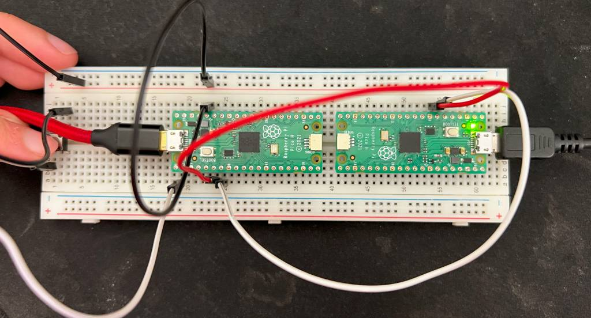

# What does this do
This is supposed to demonstrate communication over UART. In this case, the
aim is to have a button hooked up to 1 Pi Pico, which will turn on the onboard
LED of a 2nd Pi Pico when pressed (and held), and turn it off again when the
button is released, via data over UART.

There are some problems with the current implementation, it doesn't always work. I think it may be something to do with how the data is read on receipt, but that's still on my 'to-learn' list.