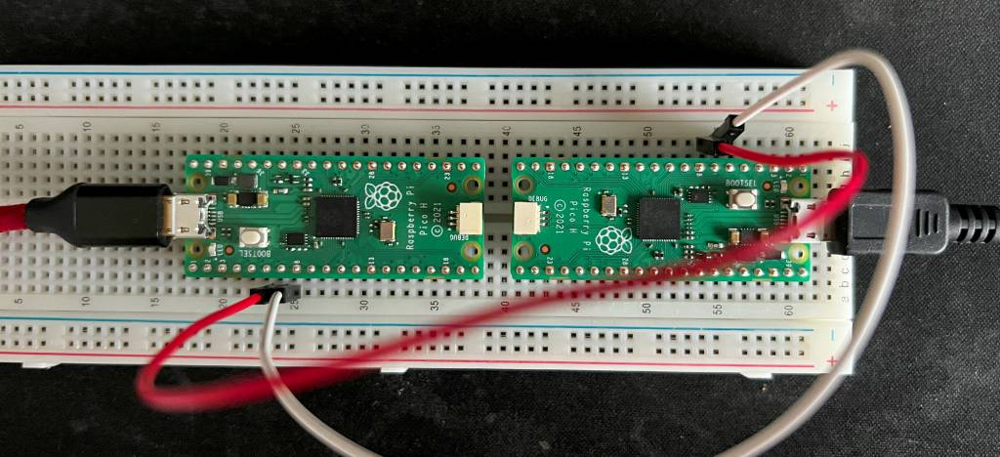

# What does this do
This is supposed to demonstrate communication over UART. In this case, the
aim is to have the 1st Pico send a command over UART to the 2nd Pico to turn on its LED. The 2nd Pico then sends a command to the 1st Pico over UART to turn on its LED.

The LEDs end up alternating turning on and off between the 2 Picos.

